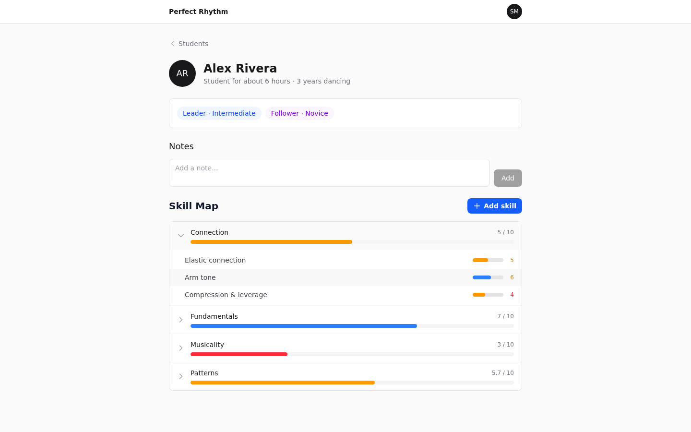
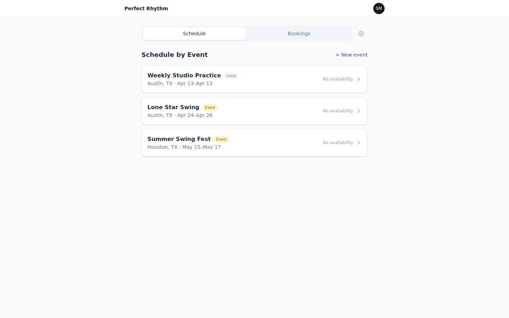

# perfectRhythm

A mobile-first coaching platform for West Coast Swing (and other partner dances), built as a **white-labeled single-teacher product**: each teacher gets their own deployment — own domain, database, and branding — so their students land on a branded site, see real availability, and book directly.

## Features

- **Skill Roadmap** — per-student skill tracking across categories (fundamentals, connection, musicality, patterns) with effort/benefit scoring and AI-assisted prioritization. Coach edits outrank AI suggestions, which outrank student self-assessments.
- **Video Review** — students upload practice videos; the coach annotates with drawing, voice, and playback tools, and a composite review video is rendered back (Mux + server-side FFmpeg).
- **Lesson Scheduling** — the coach publishes availability tied to events and locations; students book within those blocks with tiered priority access.


*Coach view: a student's skill map — category rollups with per-skill scores underneath.*


*Scheduling is event-centric: availability attaches to studio nights and weekend events, the way partner-dance lessons actually happen.*

## Stack

SvelteKit (Svelte 5) + TypeScript · Tailwind v4 + shadcn-svelte · PostgreSQL + Drizzle ORM · self-hosted session auth (scrypt) · Supabase Storage · Mux + FFmpeg (video) · Fabric.js (annotation canvas) · Claude API (skill prioritization) · Resend + Twilio (notifications) · adapter-node, one instance per teacher

## Development

```sh
pnpm install
pnpm db:start       # Postgres via docker compose (or point DATABASE_URL at your own)
pnpm db:push        # apply the Drizzle schema
pnpm db:seed        # demo coach + student (coach@test.com / student@test.com, password123)
pnpm dev
```

The public landing page is `/`; the app lives behind auth at `/dashboard`. Public signup is student-only and auto-attaches new students to the deployment's owner coach; the teacher account is created with `pnpm teacher:create`.

## Architecture notes

- All mutations go through versioned `/api/v1/` endpoints with Zod validation and a uniform `{ data, error }` response shape — kept cleanly separable for a future Capacitor shell.
- Role checks are server-side only; a coach's "invisible block" of a student is enforced at the query layer so it is never detectable client-side.
- A calendar day ends at 2 a.m. — scheduling logic uses a shared `toScheduleDate()` boundary utility, because dance nights do not end at midnight.
